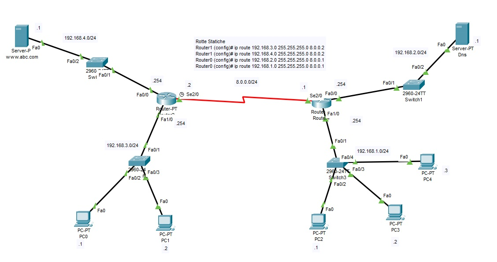

<!DOCTYPE html PUBLIC "-//W3C//DTD HTML 4.01//EN" "http://www.w3.org/TR/html4/strict.dtd">
<html><head>
  
  <meta content="text/html; charset=ISO-8859-1" http-equiv="content-type">
 

  
</head><body>
<h1>Access List Estese</h1>

<h2>Scenario: 2 reti locali, una rete tra router, una rete con server web e una rete con
server Dns.&nbsp;  
</h2>

 

 

 

Le
access lists estese (100 &#8211; 199), permettono o negano il traffico sulla
base dell&#8217;indirizzo IP o della rete sorgente,&nbsp;&nbsp;negano
o permettono il traffico sulla base dell&#8217;indirizzo IP o della rete di
destinazione,&nbsp;negano
o permettono il traffico sulla base del numero di porta (servizio http,
ftp, dns ecc..) e/o del protocollo (udp, tcp, ecc). Nella access list
estesa sono sempre indicati la sorgente e la destinazione e
opzionalmente il numero di porta, servizio o protocollo. Si applicano il più vicino
possibile alla sorgente. 

 

Dopo aver impostato le rotte statiche
sui router, gli indirizzi ip dei gateway e del dns su ciascun pc,
configurato e attivato il DNS e il server WEB sui server:  

 

1) Si imposta una access list estesa
numero 100 per bloccare il traffico IP proveniente dal pc con indirizzo
192.168.1.3 e diretto al pc con indirizzo IP 192.168.3.1. Si inserisce
alla fine l'struzione permit ip any (sorgente) any (destinazione),
altrimenti verrà applicata l'istruzione implicita deny, consentendo in
questo modo, al traffico di altro tipo di percorrere la rete. Si
applica l'access list all'interfaccia Fa1/0 in ingresso; 

 

Router#conf t
 

Router(config)#access-list 100 deny
ip host 192.168.1.3 host 192.168.3.1 

Router(config)#access-list 100 permit
ip any any 

Router(config)#int Fa1/0 

Router(config-if)#ip access-group 100
in 

 

Nella configurazione sarà bloccato il
traffico proveniente dal pc con indirizzo ip 192.168.1.3 e diretto al
pc con indirizzo ip 192.168.3.1 mentre sarà consentito tutto il
restante traffico compreso quello ad esempio proveniente sempre dal pc
con indirizzo ip 192.168.1.3 ma direttto al server Web con indirizzo ip
192.168.4.1; 

 

2) Si vuole consentire il traffico
Web dalla rete 192.168.3.0 e si vuole consentire il
traffico Web solo all'host con indirizzo ip 192.168.1.1. Il rimanente
traffico tra le reti risulterà bloccato sfruttando l'istruzione deny
implicita presente nelle access-list. 

Sul router di destra si elimina
l'access list precedentemente inserita e si imposta la nuova access
list per il traffico Web dell'host con indirizzo ip 192.168.1.1. 

 

Router&gt;enable

Router#conf
t

Router(config)#no
access-list 100

Router(config)#int
Fa1/0

Router(config-if)#no
ip access-group 100 in

 

E' necessario abilitare il traffico
udp porta 53 del server DNS con  

 

Router(config)#access-list 100 permit
udp 192.168.1.1 0.0.0.0 192.168.2.1 0.0.0.0 eq 53 

 

E' necessario abilitare il traffico
tcp porta 80 del server Web protocollo HTTP  

 

Router(config)#access-list 100 permit
tcp 192.168.1.1 0.0.0.0 192.168.4.1 0.0.0.0 eq 80 

 
&nbsp;Successivamente si applica
l'access-list 100 all'interfaccia Fa1/0 del router in ingresso. La deny
implicita blocca il rimanente traffico. 

 

Router(config-if)#ip access-group 100
in 

 

Sul router di sinistra per la rete
192.168.3.0/24 si abilita il traffico per il protocollo Udp porta 53
relativo al server DNS e il traffico tcp porta 80 relativo al server
WEB protocollo HTTP: 

 

Router&gt;enable

Router#conf
t

Router(config)#access-list
100 permit udp 192.168.3.0 0.0.0.255 192.168.2.1 0.0.0.0 eq 53

Router(config)#access-list
100 permit tcp 192.168.3.0 0.0.0.255 192.168.4.1 0.0.0.0 eq 80

Router(config)#int
fa1/0

Router(config-if)#ip
access-group 100 in

Router(config-if)#

 

 

 

 

 

 

 

 

&nbsp; 

 

 

 

</body></html>