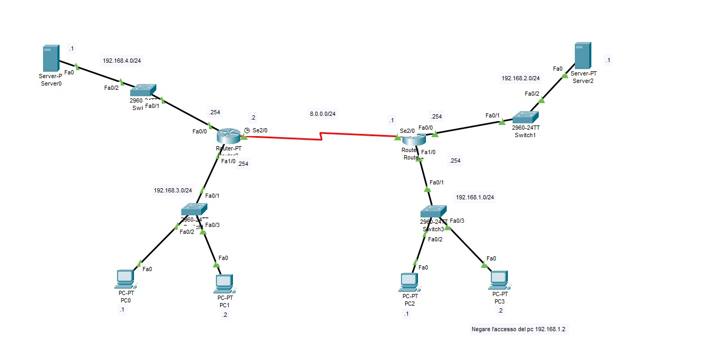
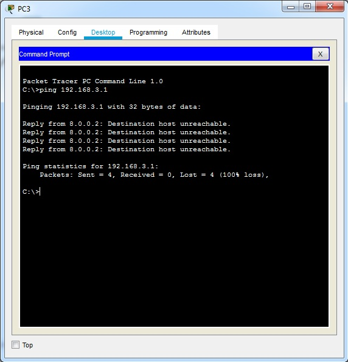

<!DOCTYPE html PUBLIC "-//W3C//DTD HTML 4.01//EN" "http://www.w3.org/TR/html4/strict.dtd">
<html><head>
  
  <meta content="text/html; charset=ISO-8859-1" http-equiv="content-type">

  <title></title>
</head><body>

 

<big><big><big>Firewal
Access List Standard 
</big></big></big>

 

Le access lists standard (1 &#8211; 99)&nbsp; permettono
o negano il traffico
sulla base dell&#8217;indirizzo IP o dell'indirizzo di rete sorgente. Si
applicano il più vicino possibile
alla destinazione.<o:p></o:p>

<o:p></o:p>Le access lists estesa (100 &#8211; 199),
permettono o negano il traffico sulla base dell&#8217;indirizzo IP o
della rete sorgente, &nbsp;negano o permettono
il
traffico sulla base dell&#8217;IP o della rete di destinazione, negano o permettono il traffico sulla base del
numero di porta (servizio http, ftp, dns ecc..). Nella access list
estesa sono
sempre indicati la sorgente e la destinazione e opzionalmente il numero
di
porta o servizio. Si applicano il più vicino
possibile alla sorgente.

I passaggi sono:<o:p></o:p>

1) si crea una access list; <o:p></o:p>

2) si applica l&#8217;access list alla interfaccia del
router
(Inbound Outbound). Inbound significa che posizionandosi al centro del
router
il traffico entra. mentre Outbound significa che posizionandosi al
centro del
router il traffico esce.  <o:p></o:p>

 

 

 

 

 

Si vuole negare il traffico proveniente dal pc con indirizzo Ip
sorgente 192.168.1.2 e destinato alla rete 192.168.3.0/24.&nbsp;
L'access list standard verrà applicata alla interfaccia Fa1/0 del
router di sinistra e cioè all'interfaccia&nbsp; più vicina possibile
alla destinazione 

I comandi da impostare nella Cli del router sono: 

 

Router&gt;enable

Router#conf t

Router(config)#access-list 1
deny 192.168.1.2 0.0.0.0

Router(config)#access-list 1
permit any

Router(config)#int fa1/0

Router(config-if)#ip
access-group 1 out

Router(config-if)#  

 

All'indirizzo IP dell'access list si applica la wild mask (maschera di
rete inversa). In presenza del valore zero nella wild mask la regola è
verificata se l'ottetto corrispondente del pacchetto è identico al
corrispondente ottetto dell'indirizzo indicato nella access list. Per
bloccare ad esempio una rete classfull di tipo C /24&nbsp; la wild mask
sarà 0.0.0.255 e cioè solo i primi tre ottetti dell'indirizzo devono
corrispondere mentre nel caso di un singolo host la maschera sarà
0.0.0.0 in quanto tutti gli ottetti dell'indirizzo IP dovranno
corrispondere. Il comando ip access-group applica l'access lista
all'interfaccia. 

Le regole impostate sull'access list vengono esaminate dal router in
sequenza in base all'ordine di inserimento (di priorità). Le regole più
restrittive sono inserite all'inizio della sequenza. Per ogni pacchetto
vengono verificate le singole regole. La prima regola che risulta
verificata viene applicata e il firewall termina l'analisi. Se nessuna
regola è verificata allora il firewall applica la regola di default che
può essere blocca tutto (deny all) oppure consenti tuuto (permit any). 

 

Il ping effettuato dal pc con indirizzo 192.168.1.2 verso uno degli
host della rete 192.168.3.0 fallisce in quanto il router firewall ne
blocca il traffico. 

 

 

 

 

 

 

</body></html>