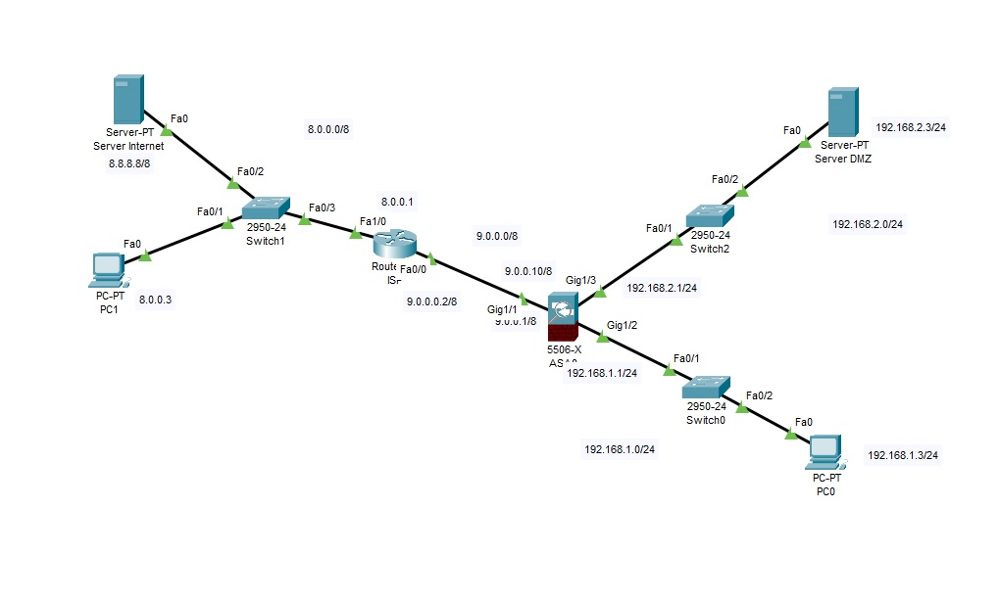
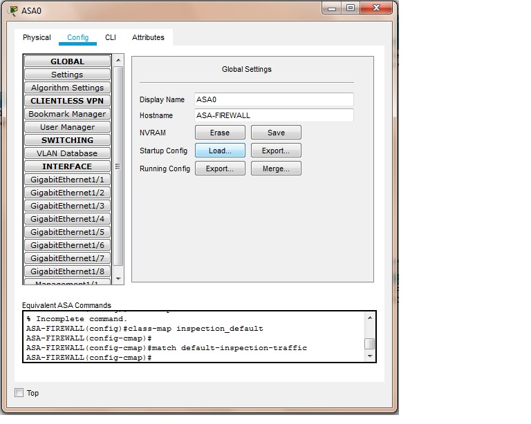

<!DOCTYPE html PUBLIC "-//W3C//DTD HTML 4.01//EN" "http://www.w3.org/TR/html4/strict.dtd">
<html><head>
  
  <meta content="text/html; charset=ISO-8859-1" http-equiv="content-type">
  <title></title>

  
</head><body>

<h1>Configurazione del Firewall ASA 5506 rete DMZ e Rete Trust</h1>

L'ASA 5506 è un dispositivo evoluto di
sicurezza che integra il firewall stateful, la VPN, il
dhcp,
varie tipologie di NAT e un router integrato. Il firewall protegge la
rete locale interna da attacchi esterni mentre consente l'accesso a
Internet da parte degli hosts interni. L'ASA 5506 crea interfaccie
con differenti livelli di sicurezza da 0 a 100.  
Le reti di default sono: Inside e Outside. Viene poi impostata una rete Dmz.  
Il traffico da un livello di sicurezza
più alto ad uno più basso è consentito mentre il traffico da un livello
di sicurezza più basso ad uno più alto non è permesso a meno che non si
tratta di un traffico di ritorno iniziato da host presenti su una rete
con un livello di sicurezza più alto (stateful packet inspection).  
 
Nello scenario è presente un router gestito da un&nbsp; ISP (Internet
Service Provider) e un firewall ASA 5506 a cui sono collegate una rete
Trust e una Dmz. Gli
utenti esterni hanno un&nbsp; accesso
limitato alla DMZ per il server WEB e non dispongono di
alcun accesso alla rete interna.  

 
 

Configurazione
del'interfaccia Inside: 
 
L'interfaccia Gig1/2 è configurata per la rete interna (inside) con un
livello di sicurezza pari a 100. 
 
ASA-FIREWALL(config)#interface GigabitEthernet1/2

ASA-FIREWALL(config-if)#
nameif inside

ASA-FIREWALL(config-if)#
security-level 100

ASA-FIREWALL(config-if)# ip
address 192.168.1.1 255.255.255.0

 

Configurazione
del'interfaccia Outside: 
 
L'interfaccia Gig1/1 è configurata per la rete esterna (outside) con un
livello di sicurezza pari a 0. 

 

ASA-FIREWALL(config)#interface GigabitEthernet1/1

ASA-FIREWALL(config-if)#&nbsp;
nameif outside

ASA-FIREWALL(config-if)#&nbsp; security-level 0

ASA-FIREWALL(config-if)# ip
address 9.0.0.1 255.0.0.0

 

 

Configurazione
della rotta di last resort sulla interfaccia outside

 

Impostazione della rotta verso il
gateway di last resort (router ISP) 

 

ASA-FIREWALL(config)#route outside 0.0.0.0 0.0.0.0 9.0.0.2  

 

Configurazione
del NAT-PAT (Auto-NAT) per la rete Trust 
 
Per la configurazione del NAT vengono
creati gli Object Network all'interno dei quali sono definite le regole
di traduzione 
degli indirizzi privati in pubblici e viceversa. 
 
ASA-FIREWALL(config)#object network TRUST 

ASA-FIREWALL(config-network-object)#subnet 192.168.1.0 255.255.255.0 

ASA-FIREWALL(config-network-object)#nat (inside,outside) dynamic
interface 

 

Impostazione del
Modular Policy Framework (MPF) per l'ispezione del traffico a livello
di applicazione 

 

L'MPF utilizza tre oggetti: Class
maps (definisce i criteri), Policy maps (Associa le azioni ai criteri)
e  
Service policies (le policy map sono agganciate ad una interfaccia o
impostate in modo globale a tutte le interfaccie). 
La seguente configurazione della policy map consente anche il traffico
icmp e http: 
 
ASA-FIREWALL(config)#class-map inspection_default

ASA-FIREWALL(config-cmap)#
match default-inspection-traffic

ASA-FIREWALL(config-cmap)#policy-map
type inspect dns preset_dns_map  

ASA-FIREWALL(config-cmap)#
parameters

ASA-FIREWALL(config-cmap)#
message-length maximum 512

ASA-FIREWALL(config-cmap)#policy-map
global_policy

ASA-FIREWALL(config-cmap)#
class inspection_default

ASA-FIREWALL(config-cmap)#
inspect dns preset_dns_map

ASA-FIREWALL(config-cmap-c)#
inspect ftp 

ASA-FIREWALL(config-cmap-c)#
inspect http 

ASA-FIREWALL(config-cmap-c)#
inspect icmp 

ASA-FIREWALL(config-cmap-c)#
inspect tftp 

ASA-FIREWALL(config-cmap)#service-policy
global_policy global

 

Configurazione
del'interfaccia DMZ: 
 
L'interfaccia Gig1/3 è configurata per la rete dmz&nbsp; con un livello
di sicurezza pari a 70. 

 

ASA-FIREWALL(config)#interface GigabitEthernet1/3

ASA-FIREWALL(config-if)#&nbsp;
nameif dmz

ASA-FIREWALL(config-if)#&nbsp; security-level 70

ASA-FIREWALL(config-if)# ip
address 192.168.2.1 255.255.255.0

 

Configurazione del static NAT per il server
nella DMZ con un network object 
 

L'object
Network specifica che l'indirizzo del server nella DMZ è tradotto con
l'indirizzo pubblico 9.0.0.10 

 

ASA-FIREWALL(config)#object network DMZ 

ASA-FIREWALL(config-network-object)#host 192.168.2.3 

ASA-FIREWALL(config-network-object)#nat (dmz,outside) static 9.0.0.10 

 

Configurazione
dell' Access List (ACL) per il traffico da Internet verso la DMZ: 
 
L'access list ACLDMZ permette il il
traffico IP da hosts esterni al server interno alla DMZ. L' acl è
applicata 
all'interfaccia esterna outside in ingresso 
 
ASA-FIREWALL(config)#access-list ACLDMZ extended permit
ip any host 192.168.2.3 

ASA-FIREWALL(config)#access-group ACLDMZ in interface outside 

 

Impostazione
dell'intera configurazione sull'ASA 5506 utilizzando il file
startup-config 
 
Da Config -&gt; Bottone
Load di Startup Config&nbsp; -&gt; selezionare il file startup-config e
ricaricare il sistema: 
 
ASA-FIREWALL#reload 

 
 
 

 

 

 

 

 

</body></html>