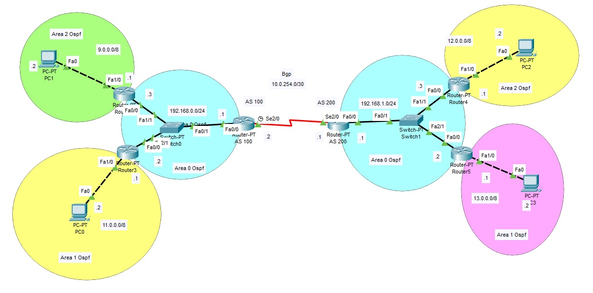

<!DOCTYPE html PUBLIC "-//W3C//DTD HTML 4.01//EN" "http://www.w3.org/TR/html4/strict.dtd">
<html><head>

  
  <meta content="text/html; charset=ISO-8859-1" http-equiv="content-type"></head><body>
<h1>Configurazione del protocollo BGP
(Border Gateway Protocol)  
</h1>
<h1>Redistribuzione delle rotte tra BGP e OSPF</h1>

 
Ogni AS è
costituito da un insieme di reti sotto un unico controllo
amministrativo che utilizzano, al loro interno, un protocollo di routing di tipo (IGP) 
Interior Gateway
Protocolo come l'OSPF.  

I Border Router (Router di confine)
realizzano la connessione fra AS diversi e possono essere considerati quindi come punto di ingresso e di uscita verso altri AS.  
I partecipanti alle comunicazioni sono esplicitamente selezionati non
tra i router di next-hop come negli IGP ma tra macchine raggiungibili
nell&#8217;internet (neighbor AS). 

Ogni Autonomous System dispone di un
proprio numero identificativo che viene rilasciato da IANA su scala mondiale.
 
Il protocollo BGP è un Exterior
Gateway Protocol di tipo Path Vector utilizzato dai router di confine
per lo
scambio di rotte tra Autonomous Systems.  Ogni messaggio contiene il numero di AS e l'intero percorso da
attraversare verso la destinazione.  
Due sistemi autonomi possono venire a
conoscenza uno delle rotte interne dell'altro tramite la redistribuzione. 

 

 
 Nello scenario sono presenti due router
di confine per i sistemi autonomi AS 100 e AS 200. Al loro interno sono
presenti un insieme di reti che utilizzano il 
protocollo OSPF per le rotte intra e inter Area. Viene effettuata la
redistribuzione delle rotte OSPF nel BGP e la redistribuzione delle
rotte BGP nell'OSPF. 
 
 
 
 

 

 

 
Configurazione del sistema autonomo AS 100: 
 
Router(config)#router bgp 100 
Router(config-router)#neighbor 10.0.254.1 remote-as 200

Router(config-router)# redistribute ospf 1
 

Router(config)#router ospf 1

Router(config-router)# redistribute bgp 100 subnets 

Router(config-router)# network 192.168.0.0 0.0.0.255 area 0

Router(config-router)# default-information originate

 
 

Configurazione del sistema autonomo AS 200: 
 

Router(config)#router bgp 200 

Router(config-router)#neighbor 10.0.254.2 remote-as 100

Router(config-router)# redistribute ospf 1

 

Router(config)#router ospf 1

Router(config-router)# redistribute bgp 200 subnets 

Router(config-router)# network 192.168.1.0 0.0.0.255 area 0

Router(config-router)# default-information originate

 

 

Ogni
volta che una nuova subnet viene aggiunta all'OSPF automaticamente
questa nuova rotta viene acquisita dall'AS confinante (neighbor).

 

 Tabella di routing dell'AS 100

 

Router#show ip route

Codes: C - connected, S - static, I - IGRP, R - RIP, M - mobile, B - BGP

       D - EIGRP, EX - EIGRP external, O - OSPF, IA - OSPF inter area

       N1 - OSPF NSSA external type 1, N2 - OSPF NSSA external type 2

       E1 - OSPF external type 1, E2 - OSPF external type 2, E - EGP

       i - IS-IS, L1 - IS-IS level-1, L2 - IS-IS level-2, ia - IS-IS inter area

       * - candidate default, U - per-user static route, o - ODR

       P - periodic downloaded static route

 

Gateway of last resort is not set

 

O IA 9.0.0.0/8 [110/2] via 192.168.0.3, 00:30:22, FastEthernet0/0

     10.0.0.0/30 is subnetted, 1 subnets

C       10.0.254.0 is directly connected, Serial2/0

O IA 11.0.0.0/8 [110/2] via 192.168.0.2, 00:30:12, FastEthernet0/0

B    12.0.0.0/8 [20/2] via 10.0.254.1, 00:00:00

B    13.0.0.0/8 [20/2] via 10.0.254.1, 00:00:00

C    192.168.0.0/24 is directly connected, FastEthernet0/0

B    192.168.1.0/24 [20/20] via 10.0.254.1, 00:00:00

 
Tabella di routing dell'AS 200 
 
Router#show ip route

Codes: C - connected, S - static, I - IGRP, R - RIP, M - mobile, B - BGP

       D - EIGRP, EX - EIGRP external, O - OSPF, IA - OSPF inter area

       N1 - OSPF NSSA external type 1, N2 - OSPF NSSA external type 2

       E1 - OSPF external type 1, E2 - OSPF external type 2, E - EGP

       i - IS-IS, L1 - IS-IS level-1, L2 - IS-IS level-2, ia - IS-IS inter area

       * - candidate default, U - per-user static route, o - ODR

       P - periodic downloaded static route

 

Gateway of last resort is not set

 

B    9.0.0.0/8 [20/2] via 10.0.254.2, 00:00:00

     10.0.0.0/30 is subnetted, 1 subnets

C       10.0.254.0 is directly connected, Serial2/0

B    11.0.0.0/8 [20/2] via 10.0.254.2, 00:00:00

O IA 12.0.0.0/8 [110/2] via 192.168.1.3, 00:32:18, FastEthernet0/0

O IA 13.0.0.0/8 [110/2] via 192.168.1.2, 00:32:18, FastEthernet0/0

B    192.168.0.0/24 [20/1] via 10.0.254.2, 00:00:00

C    192.168.1.0/24 is directly connected, FastEthernet0/0

 

</body></html>