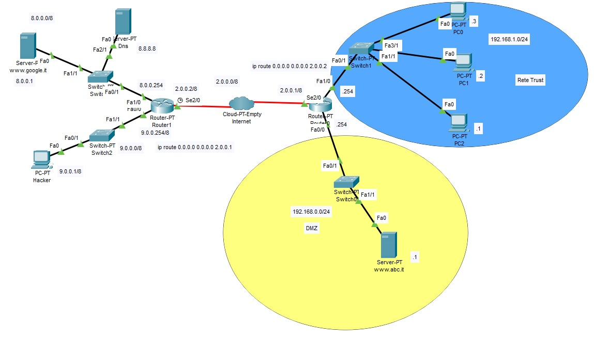

<!DOCTYPE html PUBLIC "-//W3C//DTD HTML 4.01//EN" "http://www.w3.org/TR/html4/strict.dtd">
<html><head>
  
  <meta content="text/html; charset=ISO-8859-1" http-equiv="content-type">
  

  
</head><body>

<h1>DMZ con un Router Firewall:
NAT-PAT (Port Forwarding) su Server Web e Server Mail Smtp. 
</h1>

Nello scenario il router svolge due
funzioni: 
1) esegue il NAT (Network Address Translation) sul traffico in uscita
traducendo l'indirizzo IP di origine dei pacchetti provenienti dalla
LAN interna nell'indirizzo pubblico dell'interfaccia esterna; 
2) instrada in modo appropriato il traffico in entrata verso la LAN
interna Trust oppure esegue il PAT (Port Address Translation)
individuando il servizio sul server nella DMZ in base  
al numero di
porta di destinazione (ad esempio porta 80 protocollo Tcp); 
 
Nella configurazione delle access list l'opzione established
consente il traffico di ritorno TCP in presenza di connessioni già
attivate (o che sembrino tali) da richieste originate dalla rete locale
interna.  
Il router
(firewall) verifica che i segmenti TCP abbiano i flag ACK o RST
impostati ad "1" cosa questa che caratterizza i messaggi delle connessioni
già aperte.  
Le richieste di nuove connessioni TCP provenienti
dall'esterno caratterizzate dall'avere il flag SYS impostato ad "1"
vengono quindi scartate.  
Inoltre nella configurazione delle Access List (ACL) con il NAT: 
1) per il traffico in uscita dal router il NAT è attivato prima&nbsp;
delle ACL;  
2) Per il traffico in entrata sul router sono attivate prima le ACL e
poi il NAT;  
 
Rete LAN:&nbsp; 192.168.1.0/24. 
Rete DMZ: 192.168.0.0/24 con server Http e server Mail Smtp configurati
sullo stesso Host con indirizzo ip 192.168.0.1. 
 
Regole Access List da applicare sull'interfaccia pubblica del router: 
1)&nbsp; permettere il traffico HTTP entrante verso il Server Web porta
80 e porta 443; 
2)&nbsp; permettere il
traffico Smtp entrante verso il Server Mail porta 25; 
3)&nbsp; permettere il traffico di rientro delle sessioni TCP aperte
dall'interno della rete locale Trust con l'opzione established; 
4)&nbsp; permettere il transito delle risposte ai PING lanciati
dall'interno della rete locale Trust; 
5)&nbsp; blocchi ogni altro tipo di traffico entrante ad esempio
proveniente dal pc Hacker; 

 

 

 

 

 

 

 

 

Configurazione del NAT-PAT sul router: 
 
Si definisce un insieme di indirizzi della rete trust (access-list) per
i quali è consentito abilitare il NAT. 

 

Router&gt;enable 
Router#conf
t 

Router(config)#access-list 1 permit 192.168.1.0 0.0.0.255 

 

&nbsp;  
la access list 1 dovrà essere
tradotta in NAT in base all' indirizzo IP dell'interfaccia se2/0 del
router in modalità overload (utilizzando un unico indirizzo IP per la traduzione delle porte).  
 
Router(config)#ip nat inside source list 1 interface ser2/0 overload 
 
Si configurano i ruoli delle interfacce del router: 
 

Router(config)#int fa 1/0

Router(config-if)#ip nat inside

Router(config-if)#int fa0/0

Router(config-if)#ip nat inside

Router(config-if)#int se2/0

Router(config-if)#ip nat outside

 

Per realizzare la DMZ dove è collocato il server Web e Smtp è utilizzato il port forwarding. Il router inoltra automaticamente all&#8217;indirizzo di destinazione&nbsp; il pacchetto  

sulla base del numero della porta rendendone così disponibili i relativi servizi all'esterno. 

 
Router#conf t
 

	

Router(config)#ip nat inside source static tcp 192.168.0.1 80 2.0.0.1 80 
Router(config)#ip nat inside source static tcp 192.168.0.1 25 2.0.0.1 25 

 

 

// consente il traffico di ritorno TCP in presenza di connessioni già
attivate 

Router(config)#access-list 100 permit tcp any 2.0.0.1 0.0.0.0 established

 

// consente il traffico dall'esterno sul server Web nella DMZ 

Router(config)#access-list 100 permit tcp any 2.0.0.1 0.0.0.0 eq 80

 

// consente il traffico dall'esterno sul server SMTP nella DMZ

Router(config)#access-list 100 permit tcp any host 2.0.0.1 eq 25

 

// Consente la risposta del DNS esterno 

Router(config)#access-list 100 permit udp any eq 53 host 2.0.0.1

 
// consente il transito delle risposte ai PING lanciati
dall'interno della rete locale Trust;

	

Router(config)#access-list 100 permit icmp any any echo-reply

 

Router(config)#int se2/0

// L'ACL 100 va applicata alla porta Se2/0 in ingresso 

Router(config-if)#ip access-group 100 in

Router(config-if)#

 
 
 

 

</body></html>