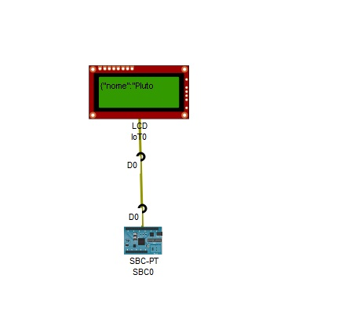
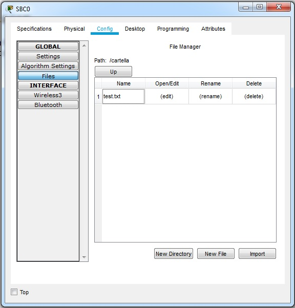

<!DOCTYPE html PUBLIC "-//W3C//DTD HTML 4.01//EN" "http://www.w3.org/TR/html4/strict.dtd">
<html><head>
  
  <meta content="text/html; charset=ISO-8859-1" http-equiv="content-type">
  
  
</head><body>
<h1>Gestione File, funzioni, formati Json, array in Javascript con
packet tracer</h1>

Scheda SBC0 selezionare Programming
-&gt; progetto FileSystem -&gt; scrpt main.js. Il programma crea una
cartella e un file, carica le righe, in formato Json, del file  
in un&nbsp; array di oggetti che viene poi ordinato in base a due
distinti criteri. Il
contenuto dell'array è stampato sul monitor seriale e sul display lcd. 

 

 

 

Il file con i dati salvati si trova
in Config -&gt; Files 

 

 

 

 
</body></html>