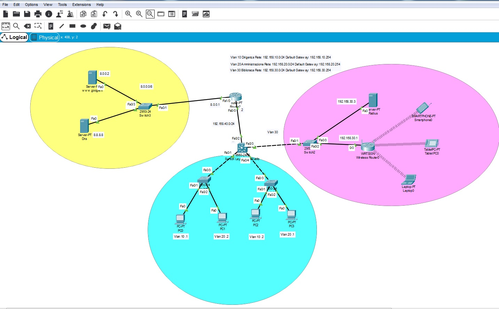
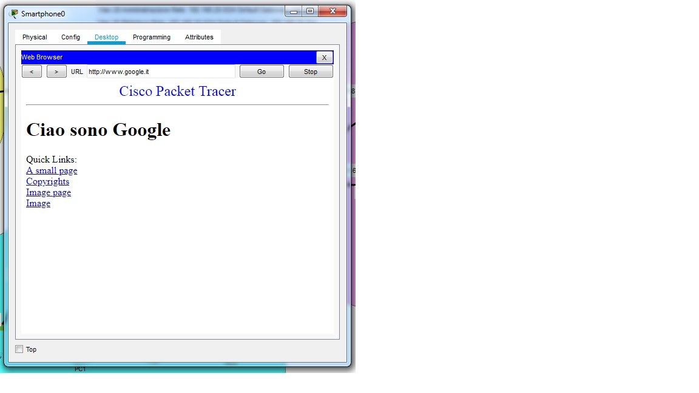

<!DOCTYPE html PUBLIC "-//W3C//DTD HTML 4.01//EN" "http://www.w3.org/TR/html4/strict.dtd">
<html><head>
  
  <meta content="text/html; charset=ISO-8859-1" http-equiv="content-type">
  <title>prova</title>

  
</head><body>
<h1>Scenario: 3 Vlan, 1 Switch Layer 3 Multilivello, comunicazioni tra
Vlan con router, 1a rete
Wifi&nbsp; appartenente alla Vlan 3 con Server Radius di autenticazione
degli utenti,&nbsp; 1a rete Internet son sito Web e Dns.</h1>

<h1> 
</h1>

<h1>&nbsp;</h1>

<h1>Procedimento:</h1>

1) Caricare il database delle Vlan negli
switch: 

 

 
 
 

 

2) Assegnare le porte Access o Trunk alle rispettive Vlan negli switch: 

 

 

 

 

3) Impostare il dhcp nel router wifi impostando la mashera di rete e il
dns e salvare;  

 

 

 

 

4) Impostare l'indirizzo ip, la maschera di rete nella scheda Internet
del router wifi 

 

 

 

 

5) Impostare la scheda Ethernet del server Radius: 

 

 

 

 

 

6) Impostare il default gateway sul server radius. Il gateway è svolto
dallo switch layer 3 

 

 

 

 

7) Impostare il servizio AAA del server radius:&nbsp;
 

 

 

 

 

 

8) Impostare la Wirelss Security sul router wifi 

 

 

 

 

9) Configurare la wireless dei dispositivi inserendo gli utenti
caricati precedentemente nel server Radius 

 

 

 

 
 
10) Configurare le interfacce virtuali delle Vlan nello switch
layer 3 , abilitare&nbsp; i pool dhcp per ogni vlan, impostare la
scheda verso il router come no switch port e assegnare l'indirizzo ip,  

&nbsp;&nbsp;&nbsp;&nbsp;&nbsp;&nbsp; impostare la rotta di default
0.0.0.0&nbsp; 0.0.0.0. verso il router e abilitare il routing tra le vlan. Lanciare il comando
sh ru nella cli dal prompt switch# (altrimenti enable o exit)
per vedere i comandi inseriti. 

 

 

 
 
 
 
 
 
11) impostare sul router l'indirizzo ip della porta&nbsp; 8.0.0.1
verso&nbsp; la rete Internet e impostare le rotte statiche verso le
reti delle vlan interne della rete trust. Nella cli del router è
comunque possibile vedere i comandi inseriti digitando sh ru 
 
 

 

 
 
12) Inpostare gli indirizzi ip delle porte e del getaway sui server Web
e Dns della rete Internet. Configurare e abilitare il servizio Dns 
 

 

 
13) Verificare la navigazione dai browser dei pc client della rete
interna e della rete wifi 
 

 

</body></html>