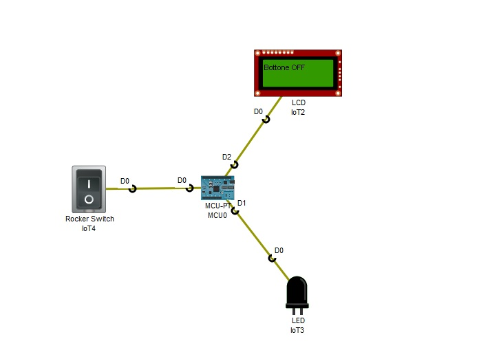

<!DOCTYPE html PUBLIC "-//W3C//DTD HTML 4.01//EN" "http://www.w3.org/TR/html4/strict.dtd">
<html><head>
  
  <meta content="text/html; charset=ISO-8859-1" http-equiv="content-type">
  
  
</head><body>
<h1>Led
comandato dal pulsante On/Off - Stringa visualizzata su Lcd</h1>

Per accendere e spegnere il led: 
 
1) Andare in Programming sulla scheda MCU, aprire il progetto LcdLed e
selezionare man.js (Javascript). Premere il pulsante Run per mandare in
esecuzione il programma; 
2)&nbsp; Premere contemporaneamente il tasto (Alt e&nbsp; il tasto
sinistro del mouse) sul pulsante&nbsp; On / Off; 
 
 

 
 
 
 

</body></html>