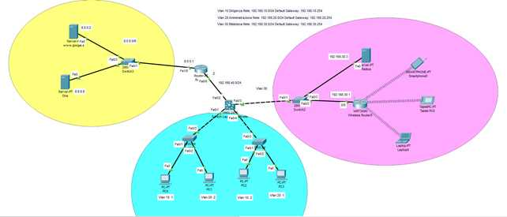
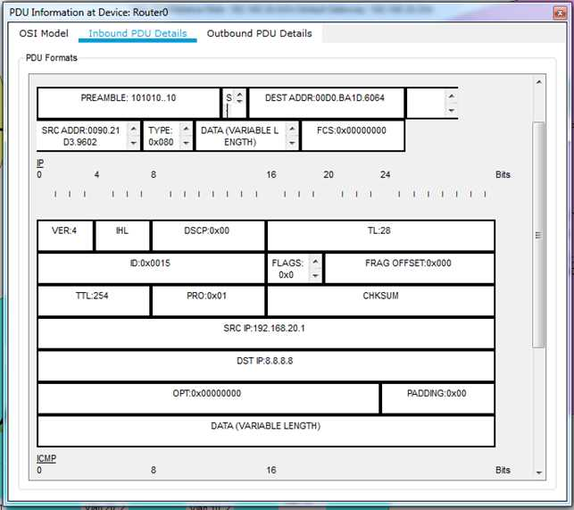
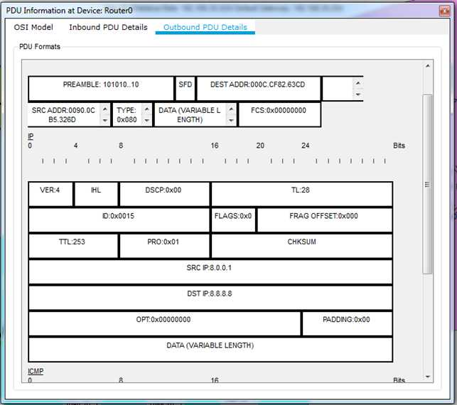
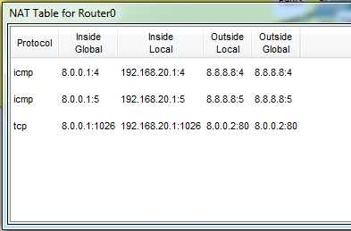

<!DOCTYPE html PUBLIC "-//W3C//DTD HTML 4.01//EN" "http://www.w3.org/TR/html4/strict.dtd">
<html><head>
  
  <meta content="text/html; charset=ISO-8859-1" http-equiv="content-type">

 
</head><body>

<b>NAT PAT
(Port Address Translation) Traduzione di più indirizzi privati in un
indirizzo
pubblico<o:p></o:p></b>

<o:p>&nbsp;</o:p>

Nel
router0
tutti gli indirizzi privati della rete Trust locale usano un unico
indirizzo IP
pubblico e svariati numeri di porta per la traduzione.<o:p></o:p>

 

 

Comandi
inseriti nel router0 per la configurazione del NAT/PAT:<o:p></o:p>

Router&gt;enable<o:p></o:p>

Router#conf t<o:p></o:p>

Router(config)#access-list 1 permit 192.168.10.0 0.0.0.255<o:p></o:p>

Router(config)#access-list 1 permit 192.168.20.0 0.0.0.255<o:p></o:p>

Router(config)#access-list 1 permit 192.168.30.0 0.0.0.255<o:p></o:p>

Router(config)#access-list 1 permit 192.168.40.0 0.0.0.255<o:p></o:p>

Router(config)#ip nat inside source list 1 interface
fa1/0 overload<o:p></o:p>

Router(config)#int fa0/0<o:p></o:p>

Router(config-if)#ip nat inside<o:p></o:p>

Router(config-if)#int fa1/0<o:p></o:p>

Router(config-if)#ip nat
outside<o:p></o:p>

<!--[if !supportLists]-->1)&nbsp;&nbsp;&nbsp;&nbsp;&nbsp;
Il
commando <b>access-list</b>
definisce gli indirizzi di rete interni che potranno essere tradotti
con NAT;<o:p></o:p>

<!--[if !supportLists]-->2)&nbsp;&nbsp;&nbsp;&nbsp;&nbsp;
Il
comando <b>ip
nat inside source list 1</b> combina la list 1 con l&#8217;interfaccia
esterna del
router. Per consentire la traduzione di più indirizzi privati in un
solo
indirizzo pubblico saranno utilizzati i numeri delle porte (<b>overload</b>);<o:p></o:p>

<!--[if !supportLists]-->3)&nbsp;&nbsp;&nbsp;&nbsp;&nbsp;
<b>ip
nat
inside</b>
definisce l&#8217;interfaccia rivolta agli indirizzi interni privati;<o:p></o:p>

<!--[if !supportLists]-->4)&nbsp;&nbsp;&nbsp;&nbsp;&nbsp;
<b>ip
nat
outside</b>
definisce l&#8217;interfaccia rivolta agli indirizzi esterni pubblici;<o:p></o:p>

<o:p></o:p><o:p></o:p><o:p></o:p>

In
modalità simulazione sul router0
il pacchetto IP in ingresso e in uscita con la traduzione
dell&#8217;indirizzo
privato in indirizzo pubblico.

 

 

 

 

 

NAT
Table<o:p></o:p>

 

 

 

 

 

 
<o:p></o:p>

 

 

</body></html>
