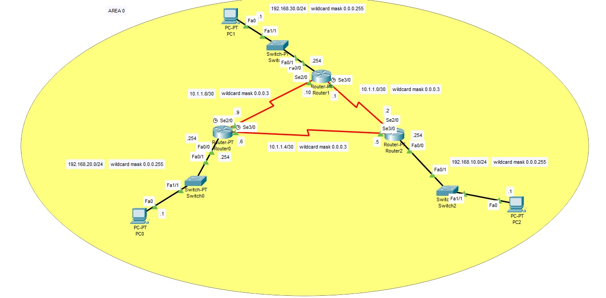

<!DOCTYPE html PUBLIC "-//W3C//DTD HTML 4.01//EN" "http://www.w3.org/TR/html4/strict.dtd">
<html><head>
  
  <meta content="text/html; charset=ISO-8859-1" http-equiv="content-type">

</head><body>
<h1 style="font-family: Arial;">Configurazione OSPF a singola area</h1>

Ospf è un protocollo di routing di tipo IGP (Interior Gateway Protocol)
ed è utilizzato per gestire l'instradamento del traffico della rete
all'interno di un Sistema Autonomo. 

Ciascun router utilizza il Link State per ottenere la rappresentazione
della topologia di rete. In pratica scambia le informazioni sulle
distanze con tutti i router della rete 

e sfruttando l'algoritmo di Dijkstra calcola i cammini nel grafo
a costo minimo e ottiene quindi la mappa della rete.  

Per rendere efficiente l'algoritmo di ricerca dei cammini minimi i nodi
della rete vengono divisi in aree aventi al massimo 50 router.
E' possibile quindi realizzare topologie di rete  

con più aree. L&#8217;area a cui tutte le altre devono essere connesse è
detta area 0 denominata backbone. 

 

 

 

 

 

Per abilitare e configurare il protocollo OSPF su ogni router è
necessario: 

1) Avviare il processo OSPF assegnando il numero di identificazione ID; 

2) Segnalare l'interfaccia. OSPF: usa la wildcard mask per segnalare le
interfacce presenti nell'area. La wildcard mask identifica gli
indirizzi che corrispondono ad un nodo all'interno di un'area. 

Il valore 0 nella wildcard mask indica che deve esserci una
corrispondenza nel bit dell'indirizzo mentre il valore 1 nella wildcard
mask indica che il valore corrispondnete del bit nell'indirizzo può
essere 1 oppure 0; 

In pratica la wildcard mask è il reciproco della subnet mask. 

Il comando è: network A.B.C.D&nbsp; wildcardmask area 0 

 

Configurazione del Router 0: 

 

Router&gt;enable

Router#conf t

Router(config)#router ospf 1

Router(config-router)#network
192.168.20.0 0.0.0.255 area 0

Router(config-router)#network
10.1.1.4 0.0.0.3 area 0

Router(config-router)#network
10.1.1.8 0.0.0.3 area 0

Router(config-router)#

 

 

Configurazione del Router 1:

 

Router&gt;enable

Router#conf t

Router(config)#router ospf 1

Router(config-router)#network
192.168.30.0 0.0.0.255 area 0

Router(config-router)#network
10.1.1.8 0.0.0.3 area 0

Router(config-router)#network
10.1.1.0 0.0.0.3 area 0

Router(config-router)# 

 

Configurazione del Router 2: 

 

Router&gt;enable

Router#conf t

Router(config)#router ospf 1

Router(config-router)#network
10.1.1.0 0.0.0.3 area 0

Router(config-router)#network
10.1.1.4 0.0.0.3 area 0

Router(config-router)#network 192.168.10.0 0.0.0.255 area 0

Router(config-router)#

 

<meta name="qrichtext" content="1">
<meta http-equiv="Content-Type" content="text/html; charset=utf-8">

 

 

 

 

 

 

 

 

 

</body></html>