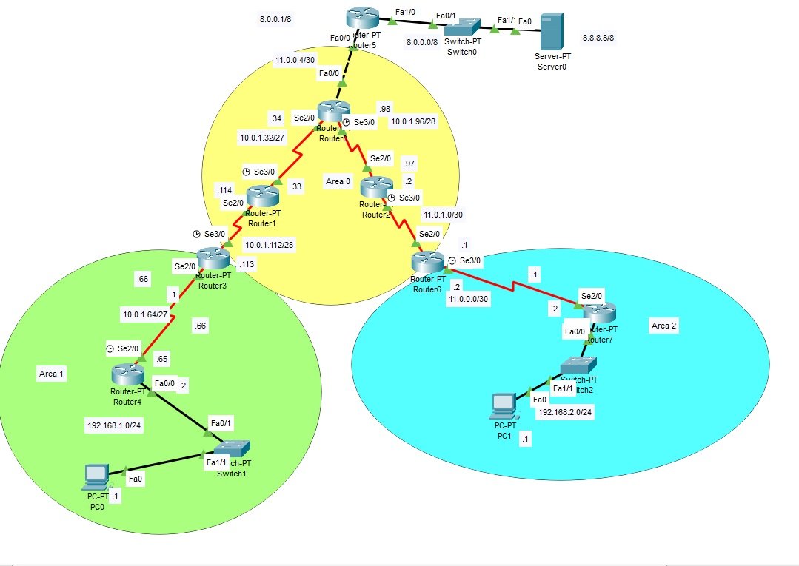

<!DOCTYPE html PUBLIC "-//W3C//DTD HTML 4.01//EN" "http://www.w3.org/TR/html4/strict.dtd">
<html><head>

  
  <meta content="text/html; charset=ISO-8859-1" http-equiv="content-type"></head><body>

<h1>OSPF Multiarea</h1>

Tutti i router, all'interno di una Area, dispongono di uno stesso database distribuito delle connessioni interne mentre i router di
confine 
tra più Aree dello stesso AS (Autonomous System) dispongono di un database per ogni Area a
cui sono collegati.  
L'Area 0 (backbone) è composta dai router di
confine di ogni singola Area, dai router che non appartengono ad altre aree e
 
dal router di confine dell'AS che scambia informazioni con altri router
di altri AS tramite il protocollo BGP. 
  

 

Configurazione per ogni router: 
&nbsp; 
1) si attiva il processo Ospf
indicandone l'id; 
2) si comunicano le interfaccie di rete direttamente
connesse indicando oltre all'indirizzo di rete, la wildcard mask e l'area di appartenenza; 

 
Configurazione del Router0: 

 
Router# router ospf 1 

Router# network 10.0.1.32 0.0.0.31 area 0

Router# network 10.0.1.96 0.0.0.15 area 0

 

Si imposta, inoltre, la rotta di default verso il router esterno al sistema
autonomo: 

 

Router(config)#ip route 0.0.0.0
0.0.0.0 fa0/0 
 

e si avvia la propagazione della rotta di default a tutti i router Ospf 

 

Router# default-information originate

 

Configurazione del Router5 esterno all'AS: 

 

Si imposta la rotta di default verso il router di confine del sistema
autonomo (nell'esempio non è attivato il BGP): 

 

Router(config)#ip route 0.0.0.0
0.0.0.0 fa0/0  

Configurazione del Router1: 

 Router# router ospf 1

Router# network 10.0.1.32 0.0.0.31 area 0

Router# network 10.0.1.112 0.0.0.15 area 0

 

Configurazione del Router3:

 

Router#router ospf 1

 Router#network 10.0.1.64 0.0.0.31 area 1

Router# network 10.0.1.112 0.0.0.15 area 0

 

Configurazione del Router4:

 

Router#router ospf 1

Router# network 10.0.1.64 0.0.0.31 area 1

Router# network 192.168.1.0 0.0.0.255 area 1

 

Configurazione del Router2:

 

Router#router ospf 1

Router# network 10.0.1.96 0.0.0.15 area 0

Router# network 11.0.1.0 0.0.0.3 area 0

 
Configurazione del Router6: 
 
Router#router ospf 1

Router# network 11.0.1.0 0.0.0.3 area 0

Router# network 11.0.0.0 0.0.0.3 area 2

 
Configurazione del Router7: 
 
Router#router ospf 1

Router# network 11.0.0.0 0.0.0.3 area 2

Router# network 192.168.2.0 0.0.0.255 area 2

 
 

 

 

 

 

</body></html>